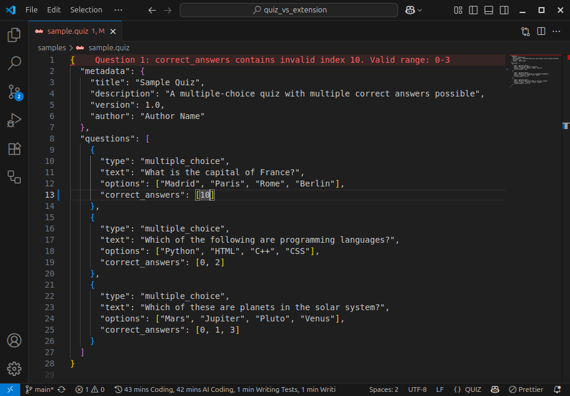

<p align="center">
  
<h1 align="center">Quiz VS Code Extension</h1>

<p align="center">
  
  
</p>

A VS Code extension that provides comprehensive support for `.quiz` files with JSON validation, syntax highlighting, and real-time diagnostics.



_The extension automatically detects `.quiz` files and provides real-time validation with detailed error messages, as shown above where invalid `correct_answers` indices are highlighted with clear diagnostic messages._

## Features

- **Automatic recognition**: `.quiz` files are automatically recognized with custom language support
- **Schema validation**: Real-time validation of quiz file structure using JSON Schema
- **Advanced diagnostics**: Detects structure errors, missing fields, and incorrect types
- **Specific validations**:
  - Valid question types (extensible architecture)
  - Correct answer indices within valid ranges
  - Required metadata fields
  - Minimum option requirements for multiple choice questions
- **Syntax highlighting**: Quiz-specific JSON highlighting
- **Code snippets**: Pre-built snippets for creating questions quickly
- **Commands**: Manual validation and sample quiz creation

## Quiz File Structure

### Basic Structure

```json
{
  "metadata": {
    "title": "Sample Quiz",
    "description": "A comprehensive quiz example",
    "version": 1.0,
    "author": "Quiz Author",
    "created_date": "2025-01-01T00:00:00Z",
    "tags": ["education", "assessment"]
  },
  "questions": [
    {
      "type": "multiple_choice",
      "text": "What is the capital of France?",
      "options": ["Madrid", "Paris", "Rome", "Berlin"],
      "correct_answers": [1]
    }
  ]
}
```

### Multiple Choice Questions

```json
{
  "type": "multiple_choice",
  "text": "Which of the following are programming languages?",
  "options": ["Python", "HTML", "C++", "CSS"],
  "correct_answers": [0, 2],
  "points": 2,
  "explanation": "Python and C++ are programming languages, while HTML and CSS are markup/styling languages."
}
```

## Requirements

- VS Code 1.102.0 or higher

## Commands

- `Quiz: Validate Quiz File`: Manually validate the current quiz file
- `Quiz: Create Sample Quiz`: Create a sample quiz file in your workspace

## Development Installation

1. **Clone this repository**

   ```bash
   git clone https://github.com/vicajilau/quiz_vs_extension.git
   cd quiz_vs_extension
   ```

2. **Install dependencies**

   ```bash
   npm install
   ```

3. **Compile the extension**

   ```bash
   npm run compile
   ```

4. **Test the extension**
   - Press `F5` to open a new VS Code window with the extension loaded
   - Create or open a `.quiz` file to test the features

## Development and Commands

### Main Commands

- `npm run compile`: Compile TypeScript and run linting
- `npm run watch`: Compile in watch mode (recompiles automatically)
- `npm run test`: Run automated tests
- `npm run package`: Create VSIX package for distribution
- `npm run vscode:prepublish`: Prepare for publishing to marketplace

### Development Workflow

1. **During active development:**

   ```bash
   npm run watch
   ```

   This maintains automatic compilation while you edit the code.

2. **To test changes:**

   - Press `F5` to launch extension in debug mode
   - Use `Ctrl+Shift+F5` to reload the extension window

3. **Before committing:**

   ```bash
   npm run compile  # Verify everything compiles without errors
   ```

4. **To create a new version:**

   ```bash
   # 1. Compile and verify
   npm run compile

   # 2. Run tests to ensure quality
   npm test

   # 3. Create VSIX package
   npm run package

   # 4. Install locally to test
   code --install-extension quiz-validator-0.0.1.vsix
   ```

### Testing

The extension includes comprehensive validation to ensure quiz file accuracy:

- **JSON Schema validation**: Validates against comprehensive schema
- **Type validation**: Ensures correct data types for all fields
- **Range validation**: Verifies `correct_answers` indices are valid
- **Structure validation**: Confirms required fields and proper nesting
- **Custom validation**: Question-type specific validation rules

```bash
# Run all tests
npm test

# Run tests in watch mode during development
npm run test:watch

# Test from VS Code: Use "Run Extension Tests" debug configuration
```

### Validation Rules

The extension validates:

- **Metadata requirements**:

  - `title`: Non-empty string
  - `description`: Non-empty string
  - `version`: Non-negative number
  - `author`: Non-empty string

- **Question validation**:

  - Valid question types (currently `multiple_choice`, extensible)
  - Non-empty question text
  - Minimum 2 options for multiple choice
  - `correct_answers` indices within valid range (0 to options.length-1)

- **JSON structure**: Proper JSON syntax and schema compliance

### Extensible Architecture

The extension is designed to easily support new question types:

```typescript
// Currently supported
type QuestionType = "multiple_choice";

// Future support planned
type QuestionType =
  | "multiple_choice"
  | "true_false"
  | "fill_in_blank"
  | "essay"
  | "matching";
```

### Project Structure

```
quiz_vs_extension/
├── .github/
│   └── assets/               # Demo images and assets
│       ├── demo.png         # Demo screenshot
│       └── icon.png         # Extension icon
├── schemas/
│   └── quiz-schema.json     # JSON Schema for validation
├── syntaxes/
│   └── quiz.tmLanguage.json # Grammar for syntax highlighting
├── snippets/
│   └── quiz.json           # Code snippets
├── samples/
│   └── sample.quiz         # Example quiz file
├── src/
│   └── extension.ts        # Main extension code
├── dist/                   # Compiled JavaScript (generated)
├── package.json            # Extension configuration
├── language-configuration.json # Language configuration
└── README.md
```

## Contributing

Contributions are welcome! Please follow these steps:

### To Contribute

1. **Fork the repository**
2. **Create a branch for your feature:**

   ```bash
   git checkout -b feature/new-question-type
   ```

3. **Make changes and compile:**

   ```bash
   npm run compile  # Verify it compiles without errors
   ```

4. **Test the extension:**

   ```bash
   # Create test package
   npm run package

   # Install it locally
   code --install-extension quiz-validator-x.y.z.vsix
   ```

5. **Commit and push:**

   ```bash
   git add .
   git commit -m "feat: add true_false question type support"
   git push origin feature/new-question-type
   ```

6. **Create Pull Request**

### Conventions

- **Commits**: Use [Conventional Commits](https://www.conventionalcommits.org/)

  - `feat:` for new features (e.g., new question types)
  - `fix:` for bug fixes
  - `docs:` for documentation changes
  - `refactor:` for refactoring

- **Code**:
  - Use TypeScript with strict types
  - Run linting before commit
  - Add comments for complex validation logic
  - Update JSON schema when adding new question types

### Adding New Question Types

To add a new question type:

1. **Update the JSON schema** (`schemas/quiz-schema.json`)
2. **Add TypeScript interfaces** (`src/extension.ts`)
3. **Implement validation logic** for the new type
4. **Add code snippets** (`snippets/quiz.json`)
5. **Update documentation** and examples

### Reporting Issues

If you find a bug or have a suggestion:

1. **Check** that a similar issue doesn't already exist
2. **Create a new issue** with:
   - Clear description of the problem
   - Steps to reproduce
   - Example `.quiz` file if relevant
   - VS Code and extension version

## License

This project is under the MIT license.
